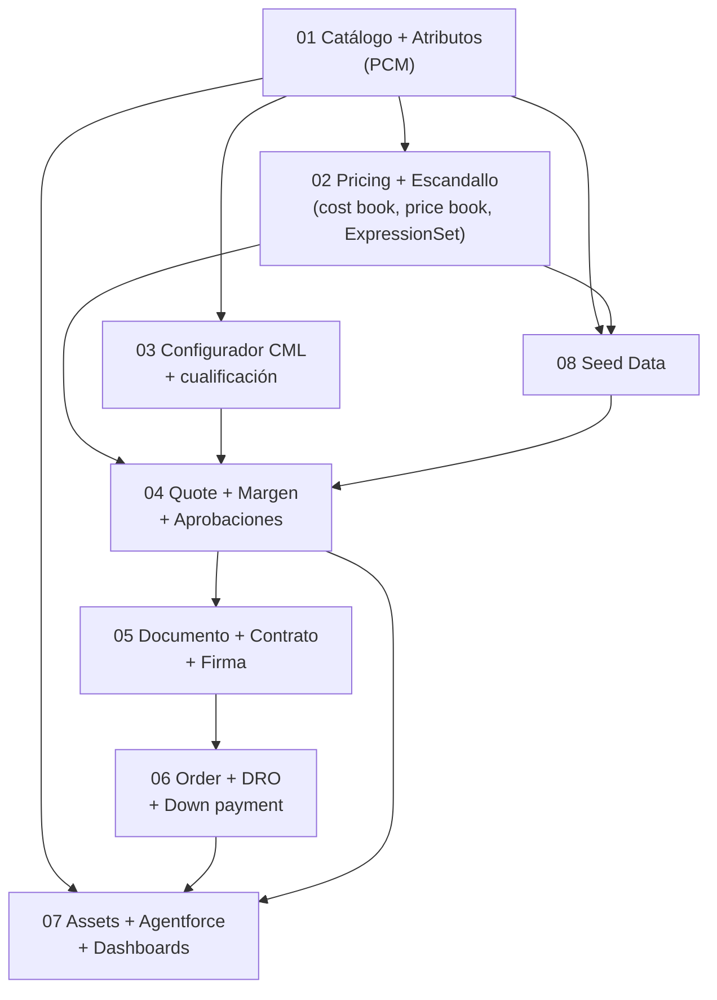

# Comexi Revenue Cloud — Build Specification

Especificación técnica ejecutable para construir el entorno de demo descrito en [`../DEMO_SCRIPT_COMEXI.md`](../DEMO_SCRIPT_COMEXI.md). Está pensada para que el agente de Cursor genere directamente: CSVs de SFDMU, `export.json`, modelos CML, metadata (ExpressionSetDefinition, DocumentTemplate, decision tables), scripts Apex y el cableado de CumulusCI.

## Enfoque: DELTA sobre la org existente (leer primero)

> **No se reconstruye nada de `rlm-base-dev`.** La org `comexi` (ver [`09-cci-wiring.md`](09-cci-wiring.md) §0) **ya tiene desplegada y poblada toda la base RLM**: motor de Revenue Cloud, contextos, pricing procedures estándar, Document Generation, constraints engine, DRO, billing, agentes base y el catálogo `qb` (314 productos, 15 ExpressionSet, 20 DocumentTemplate, 211 ExpressionSetConstraintObj).
>
> El trabajo es **solo el delta específico de Comexi**: crear lo que no existe y editar lo mínimo. Este spec describe el estado objetivo completo por dominio, pero al construir hay que **verificar primero qué ya está en la org** y no redeplegar la base.

**Regla de oro:** antes de crear cualquier cosa, `describe`/query en la org para ver si ya existe. Reutilizar; no duplicar.

### Ya existe en la org — NO tocar (reutilizar tal cual)

| Categoría | Elementos (ya desplegados) |
| :-- | :-- |
| Motor RLM | Salesforce Pricing, Product Configurator, CLM, DRO, Billing, Asset Lifecycle activos |
| Contextos | `RLM_SalesTransactionContext`, `RLM_AssetContext`, `RLM_FulfillmentAssetContext`, etc. |
| Pricing procedures estándar | `RLM_DefaultPricingProcedure`, `RLM_DefaultPricingDiscoveryProcedure`, … (los 15 `ExpressionSet`) |
| Document Generation | motor + plantillas base (los 20 `DocumentTemplate`); settings docgen |
| Constraints engine | settings, `ExpressionSetConstraintObj` cableado, bundle `post_constraints` |
| Flows de plataforma | `RLM_Assetize_Order`, `RLM_CreateOrdersFromQuote`, `RLM_Order_Contract_Creation_and_Association`, `RLM_Set_Asset_Parent_From_Relationship`, … |
| Decision tables base | `RLM_ProductQualification`, `RLM_CostBookEntries` |
| Clases Apex | `RLM_PlaceQuoteModel`, `RLM_PlaceOrderModel`, `RLM_AssetInfoUtility`, `RLM_OrderItemContractingUtility`, `DFOApexMockService` |
| Catálogo qb | los 314 `Product2` y su pricing — se dejan; el catálogo Comexi convive aparte |

### A crear / editar — el delta Comexi (lo único que se construye)

| # | Delta | Tipo | Doc |
| :-- | :-- | :-- | :-- |
| 1 | Catálogo Comexi: `ProductCatalog COMEXI_SERVICE`, categorías T/L/C/P, clasificaciones, bundle **T100**, add-on tinta, servicios y gastos | **crear** (datos, plan `comexi-pcm`) | [01](01-catalogo-atributos.md) |
| 2 | Atributos del T100 (`COMEXI_Num_CPU_GL`, `COMEXI_Num_CU_Total`, `COMEXI_RetrofitType`, `COMEXI_Charged_To`) | **crear** (datos/metadata) | [01](01-catalogo-atributos.md) |
| 3 | `COMEXI_RetrofitPricingProcedure` (escandallo) + decision tables `COMEXI_*` (uplifts, riesgo, comisión) | **crear** (metadata + datos, plan `comexi-pricing`) | [02](02-pricing-escandallo.md) |
| 4 | Campos custom `COMEXI_*` en `Quote`, `QuoteLineItem`, `Product2`, `Asset`, `Account` | **crear** (metadata) | [02](02-pricing-escandallo.md), [07](07-assets-agentforce-dashboards.md) |
| 5 | Modelo `COMEXI_T100.cml` + asociación `ExpressionSetConstraintObj` (Type/Port) | **crear** (CML + datos) | [03](03-configurador-cml.md) |
| 6 | Record types de Opportunity (`COMEXI_Comercial/Retrofitting/Servicio`) + guía y aprobación por margen | **crear/editar** (metadata) | [04](04-quote-margen-aprobaciones.md) |
| 7 | `DocumentTemplate COMEXI_RetrofitOffer` + cláusulas por idioma | **crear** (metadata + datos `comexi-clm`) | [05](05-documento-contrato-firma.md) |
| 8 | Reglas de descomposición `comexi-dro` (T100 → material SAP / intervención) | **crear** (datos) | [06](06-pedido-dro-downpayment.md) |
| 9 | Base instalada: Assets (0 hoy), Account, Case 174535, Quote inicial | **crear** (plan `comexi-seed` + PlaceQuote) | [08](08-seed-data.md) |
| 10 | Agente `COMEXI_Retrofit_Advisor` (NGA) | **crear** (aiAuthoringBundle) | [07](07-assets-agentforce-dashboards.md) |
| 11 | Dashboards de oferta y pedido | **crear** (metadata) | [07](07-assets-agentforce-dashboards.md) |

Todo lo demás que aparezca en los documentos de dominio como "reutilizar" o "patrón de referencia" **ya está en la org**: se cita para contexto, no para reconstruir.

## Premisas

- **Stack:** Revenue Cloud / RLM **100% nativo**. API **v66.0** (Spring '26 / Release 260) en todas las llamadas REST.
- **Repositorio base:** `rlm-base-dev` (CumulusCI + SFDMU), **ya desplegado en la org** `comexi`. El shape de demo se llama **`comexi`** y sigue el mismo patrón que los shapes existentes `qb` (activo) y `mfg`. Solo se añade el delta (sección anterior); la base no se re-despliega.
- **Idioma de datos de negocio:** el cliente trabaja en catalán/castellano; los nombres de producto de catálogo se conservan tal como se observaron en pantalla (p. ej. *taula d'empalmament*). Los API names y developer names van en inglés con prefijo `COMEXI_`.
- **Convención de naming:**
  - Campos custom: `COMEXI_<Nombre>__c` (p. ej. `COMEXI_Cost__c`, `COMEXI_Margin_Pct__c`).
  - Metadata (ExpressionSetDefinition, DocumentTemplate, agentes, flows): prefijo `COMEXI_`.
  - Planes SFDMU: `comexi-<dominio>` bajo `datasets/sfdmu/comexi/en-US/`.
  - Modelos CML: `scripts/cml/COMEXI_<Modelo>.cml`.
  - Tasks CCI: `insert_comexi_<dominio>_data`, `extract_comexi_<dominio>_data`, `test_comexi_<dominio>_idempotency`.

## Índice de la especificación

| # | Documento | Dominio | Escenas que habilita |
| :-- | :-- | :-- | :-- |
| 01 | [`01-catalogo-atributos.md`](01-catalogo-atributos.md) | PCM: catálogo, categorías, clasificaciones, atributos, bundle T100 | 1, 3, 4, 7 |
| 02 | [`02-pricing-escandallo.md`](02-pricing-escandallo.md) | Salesforce Pricing: cost book, price book, pricing procedure (escandallo) | 5, 6, 7, 8 |
| 03 | [`03-configurador-cml.md`](03-configurador-cml.md) | Product Configurator + CML + cualificación de viabilidad | 2, 4 |
| 04 | [`04-quote-margen-aprobaciones.md`](04-quote-margen-aprobaciones.md) | Transaction Management: Quote, QuoteLineGroup, margen, aprobaciones | 3, 5, 7, 8 |
| 05 | [`05-documento-contrato-firma.md`](05-documento-contrato-firma.md) | Document Generation + CLM + firma | 9, 10 |
| 06 | [`06-pedido-dro-downpayment.md`](06-pedido-dro-downpayment.md) | Order + DRO + Billing (down payment) | 11 |
| 07 | [`07-assets-agentforce-dashboards.md`](07-assets-agentforce-dashboards.md) | Asset Lifecycle + Agentforce (NGA) + Reports/Dashboards | 2, 12, 13, 14 |
| 08 | [`08-seed-data.md`](08-seed-data.md) | Datos de arranque (Account, Asset, Case, Quote inicial) | todas |
| 09 | [`09-cci-wiring.md`](09-cci-wiring.md) | Cableado CumulusCI, flag, flow, gaps y riesgos | infra |

## Fases de construcción

La demo comprometida es el **17 de septiembre de 2026**. Se prioriza así:

### Fase 1 — Cotizar (imprescindible)

Todo lo necesario para configurar y cotizar el retrofit T100 end-to-end delante del cliente.

Cubre escenas **1, 3, 4, 5, 6, 7, 8, 9, 12**. Documentos: 01, 02, 03, 04, 05 (documento), 08.

### Fase 2 — Las prioridades declaradas (no negociables)

Las tres mejoras que el cliente pidió con sus palabras. La 2 (precios desglosados) ya está en Fase 1; faltan:

- **Prioridad 1** — Agente de viabilidad sobre el Asset (escena **2**). Documento 07 + 03 (cualificación).
- **Prioridad 3** — Dashboards (escena **13**). Documento 07.

### Fase 3 — Cerrar el ciclo

- Contrato + firma (escena **10**). Documento 05.
- Order + DRO + down payment (escena **11**). Documento 06.
- Agente proactivo sobre base instalada (escena **14**). Documento 07.

## Grafo de dependencias entre dominios

Orden de carga obligatorio (coincide con `prepare_rlm_org`): **PCM → pricing → expression sets → constraints/CML → CLM → DRO → seed**. El catálogo va siempre primero porque CML, pricing y las reglas referencian datos de catálogo.

## Cableado CumulusCI (resumen)

- Flag `comexi: true` en `project: custom:` de `cumulusci.yml`.
- Flow **`prepare_comexi_demo`** que orquesta los `insert_comexi_*_data` en el orden anterior, insertado en `prepare_rlm_org`.
- Reutilizables directos del repo (no se reconstruyen):
  - Contextos: `RLM_AssetContext`, `RLM_FulfillmentAssetContext`, `RLM_SalesTransactionContext`.
  - Flows de assetización: `RLM_Assetize_Order`, `RLM_Set_Asset_Parent_From_Relationship`, `RLM_CreateOrdersFromQuote`, `RLM_Order_Contract_Creation_and_Association`.
  - Bundles unpackaged: `post_constraints`, `post_docgen`, `post_approvals`, `post_agents`.
  - Decision tables: `RLM_ProductQualification`, `RLM_CostBookEntries`.
  - Tasks: `import_cml`, `validate_cml`, `refresh_dt_asset`, `activate_and_deploy_expression_sets`, `configure_revenue_settings`.

Detalle completo en [`09-cci-wiring.md`](09-cci-wiring.md).

## Nota sobre correcciones de modelo

Antes de construir, tener presentes las correcciones frente a la terminología CPQ clásica (validadas contra las skills RLM v66.0):

1. `PricingProcedure` **no es un objeto**: es un registro de `ExpressionSet` (`ExpressionSetDefinition` + `ExpressionSetDefinitionVersion`).
2. El motor de pricing **no tiene paso de coste ni de margen**: el coste es dato (`CostBook`), el margen se calcula y se expone en campos de la Quote.
3. CML usa `->`, `require()`, `exclude()`, `message()`, `cardinality()` — **no** `implies`/`requires`/`excludes`.
4. Nunca `INSERT Quote`/`QuoteLineItem` por DML: usar `PlaceQuote`.
5. Firma electrónica nativa **sin confirmar**: gap declarado.
