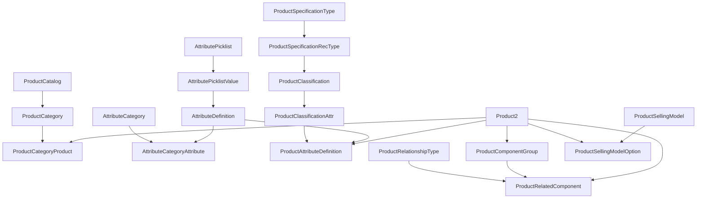

# 01 · Catálogo y Atributos (PCM)

> Sustituye las pestañas `SYS_Resume` (catálogo de 113 productos), `CTC_Products`/`CTC_Codes`, `ETO_Options`/`ETO_Codes` del `LAUNCHER - V8.4` y las fichas de producto en Drive.
>
> **Escenas:** 1 (ver Asset y su producto), 3 (oportunidad), 4 (configurar), 7 (add-on).
> **Plan SFDMU:** `comexi-pcm`. **Patrón de referencia:** `datasets/sfdmu/qb/en-US/qb-pcm/` y `datasets/sfdmu/mfg/en-US/mfg-pcm/`.

## 1. Orden de despliegue de objetos PCM

Respetar la secuencia de dependencias (misma que `qb-pcm`). Cada objeto es un CSV en `datasets/sfdmu/comexi/en-US/comexi-pcm/`.

## 2. ProductCatalog y ProductCategory

### ProductCatalog

Un único catálogo de servicio/retrofit.

| Campo | Valor |
| :-- | :-- |
| `Name` | Comexi Service & Retrofit |
| `Code` | COMEXI_SERVICE |
| `CatalogType` | `Sales` |
| `EffectiveStartDate` | 2020-01-01 |

### ProductCategory (jerarquía)

Dos ejes que el cliente usa de verdad: **familia de máquina/proceso** (prefijo del código) y **naturaleza del retrofit** (sus etiquetas). Se modela la familia como jerarquía navegable y las etiquetas como un segundo nivel/atributo.

`externalId` sugerido: `Code`.

| Code | Name | ParentCategory | Origen observado |
| :-- | :-- | :-- | :-- |
| `RETROFIT` | Retrofit | — | raíz |
| `FAM_T` | Tall / Slitting (T0xx–T3xx) | RETROFIT | familias de código en pantalla |
| `FAM_L` | Laminación y Calandras (L2xx–L9xx) | RETROFIT | |
| `FAM_C` | Periféricos CTEC (C1xx) | RETROFIT | prepremsa, laboratorio, productividad |
| `FAM_P` | Piezas (P0xx) | RETROFIT | rasqueta pipeless, etc. |
| `SERVICE` | Servicio (packs) | — | packs gold/silver (gap: hoy sin catalogar) |
| `GASTOS` | Gastos e intervención | — | desplazamientos, horas |

> Las **etiquetas del cliente** (`CTEC`, `RET_NEW_FEATURES`, `RET_OBS`, `RET_NEW_DESIGNS`, `RET_MAINT`) se modelan como valores de un atributo de clasificación `COMEXI_RetrofitType` (ver §5) para poder filtrar/reportar sin duplicar la jerarquía.

## 3. ProductClassification y ProductClassificationAttr

La clasificación es la **plantilla de atributos** que comparten los retrofits configurables. Regla dura: `Product2.BasedOnId` debe apuntar a la misma `ProductClassification` que la `ProductClassificationAttr`, o Salesforce lanza `INVALID_INPUT`.

### ProductClassification

| Code | Name | Uso |
| :-- | :-- | :-- |
| `PC_RETROFIT_PC` | Retrofit — Update PC | plantilla del T100 y similares (CPU/CU) |
| `PC_RETROFIT_GENERIC` | Retrofit genérico | retrofits sin preguntas (los "primeros automatizables", Ref. 34:55) |
| `PC_SERVICE_HOUR` | Hora de servicio | líneas de intervención |
| `PC_EXPENSE` | Gasto | desplazamientos y estancia |

### ProductClassificationAttr (para `PC_RETROFIT_PC`)

| AttributeDefinition | Sequence | IsRequired | IsPriceImpacting | DisplayType |
| :-- | :-- | :-- | :-- | :-- |
| `COMEXI_Num_CPU_GL` | 10 | true | false | Number |
| `COMEXI_Num_CU_Total` | 20 | true | false | Number |
| `COMEXI_RetrofitType` | 30 | false | false | Picklist |

> `IsPriceImpacting` se deja **`false` en el PCA** y solo se pone `true` en el `ProductAttributeDefinition` (regla del motor de attribute-based pricing; ver [`02-pricing-escandallo.md`](02-pricing-escandallo.md) §attribute-based).

## 4. Product2 — productos observados

Se cargan **solo los productos vistos en pantalla o citados en la sesión**. El catálogo completo (113 productos) requiere un extract del Sheets del cliente (gap declarado). Todos con `StockKeepingUnit` como externalId.

### Bundle protagonista y add-on

| SKU | Name | Type | BasedOnId (Classification) | Categoría | Notas |
| :-- | :-- | :-- | :-- | :-- | :-- |
| `T100` | T100 - UPDATE PC | Bundle configurable | `PC_RETROFIT_PC` | FAM_T | producto estrella del guion |
| `T100-TEMP` | Control de temperatura de tinta | Standalone add-on | — | FAM_T | **+3.600 €**, línea separada (no componente) |

### Componentes del bundle T100 (opcionales observados en `ETO_Options`, Ref. 34:55–36:23)

| SKU | Name | Rol en el bundle |
| :-- | :-- | :-- |
| `T100-CPU-SIM` | Canvi CPU Simotion | opcional |
| `T100-CU-SIN` | Canvi CU Sinamics | opcional |
| `T100-HMI` | Pupitre HMI | opcional |
| `T100-SCREEN` | Canvi de pantalla | opcional |
| `T100-CHECKLIST` | Checklist amb números de sèrie | opcional |
| `T100-W11` | Canvi de Windows 10 a Windows 11 | requerido (base del retrofit) |

### Catálogo de contexto (para que el desplegable del configurador y el agente tengan de dónde elegir)

Productos citados textualmente en la sesión (Ref. 33:20–33:49, 17:25). Se cargan como `Product2` simples de la familia correspondiente:

| SKU | Name | Familia |
| :-- | :-- | :-- |
| `T040` | Analitzador de Profibus | FAM_T |
| `T060` | Marcador digital de velocitat | FAM_T |
| `T114` | Aire condicionat | FAM_T |
| `T120` | Encintadors automàtics | FAM_T |
| `T130` | Pisors de rebobinat | FAM_T |
| `T150` | Guiador de banda per talladora | FAM_T |
| `T360` | Taula d'empalmament | FAM_T |
| `L2xx…L9xx` | Sensors de temperatura d'aigua, tractador corona, efecte hologràfic, mesclador dosificador de cola, migració de Parker a Sinamics, carros solventless/rotogravat/semiflexo/flexo, strip lamination, manteniment laminador | FAM_L |
| `C1xx` | Equipament pre-premsa, equipament laboratori, productivitat flexografia, perifèrics flexografia, productivitat laminació, productivitat tall | FAM_C |

> **Nota de construcción:** los códigos `L2xx…`/`C1xx` de la tabla son *placeholders* de familia. Se recomienda generar 4-6 SKUs concretos por familia con nombres reales de la lista para que el catálogo se vea poblado; no inventar precios (van en [`02`](02-pricing-escandallo.md), con la referencia de calibración del caso real).

### Productos de servicio (grupo Intervención, Ref. 35:57)

| SKU | Name | Classification | UoM |
| :-- | :-- | :-- | :-- |
| `SRV-MEC` | Muntatge mecànic (CC/MM) | PC_SERVICE_HOUR | Hora |
| `SRV-ELE` | Instal·lació elèctrica (IE) | PC_SERVICE_HOUR | Hora |
| `SRV-PME` | Posada en marxa software (PME) | PC_SERVICE_HOUR | Hora |
| `SRV-PMR` | Posada en marxa remota | PC_SERVICE_HOUR | Hora |
| `SRV-PI` | Proves d'aplicacions (PI) | PC_SERVICE_HOUR | Hora |

### Productos de gasto (grupo Gastos, Ref. 8:20–8:38)

| SKU | Name | Classification |
| :-- | :-- | :-- |
| `EXP-FLIGHT` | Bitllet d'avió | PC_EXPENSE |
| `EXP-TAXI` | Taxi | PC_EXPENSE |
| `EXP-CAR` | Cotxe de lloguer | PC_EXPENSE |
| `EXP-HOTEL` | Hotel | PC_EXPENSE |
| `EXP-MEAL` | Dietes (esmorzar/dinar/sopar) | PC_EXPENSE |
| `EXP-ADMIN` | Despeses d'administració | PC_EXPENSE |

### Imágenes de catálogo (`Product2.DisplayUrl`)

Los 36 SKUs llevan imagen propia con la marca Comexi (rojo `#ED1848`, antracita `#455560`, símbolo y wordmark del logo oficial). Un PNG de 512×512 por SKU, con el acento de color según la familia: rojo para `FAM_T`, granate para `FAM_L` y `FAM_C`, antracita para `SERVICE` y `GASTOS`.

| Pieza | Ubicación |
| :-- | :-- |
| Generador | `scripts/build_comexi_product_images.py` (reproducible; regenera todos los PNG) |
| Logo fuente | `scripts/assets/comexi/Comexi-logo-web.png` |
| Static resource | `unpackaged/post_comexi/staticresources/COMEXI_ProductImages/` (zip, se despliega con `deploy_post_comexi`) |
| Referencia en el dato | `DisplayUrl = /resource/COMEXI_ProductImages/<SKU>.png`, sellado por `02_products.apex` |

El sellado es idempotente: `02_products.apex` compara el `DisplayUrl` actual con el esperado y solo actualiza los productos que difieren.

## 5. Cadena de atributos (7 objetos)

Reproduce las **preguntas y opcionales** de las pestañas `ETO_Options`/`ETO_Codes`. Cadena completa: `AttributePicklist` → `AttributePicklistValue` → `AttributeDefinition` → `AttributeCategory` → `AttributeCategoryAttribute` → `ProductClassificationAttr` (§3) → `ProductAttributeDefinition`.

### AttributeDefinition

| DeveloperName | Label | DataType | Picklist |
| :-- | :-- | :-- | :-- |
| `COMEXI_Num_CPU_GL` | Nº de CPUs GL | Number | — |
| `COMEXI_Num_CU_Total` | Nº de CUs totals | Number | — |
| `COMEXI_RetrofitType` | Tipus de retrofit | Picklist | `COMEXI_RetrofitType_PL` |
| `COMEXI_Charged_To` | A càrrec de | Picklist | `COMEXI_ChargedTo_PL` |

### AttributePicklist / AttributePicklistValue

**`COMEXI_RetrofitType_PL`** (DataType `Text` — obligatorio `Text`, no `Number`, para no romper el hash de attribute-based pricing):

`CTEC`, `RET_NEW_FEATURES`, `RET_OBS`, `RET_NEW_DESIGNS`, `RET_MAINT`.

**`COMEXI_ChargedTo_PL`** (DataType `Text`): `Comexi`, `Client`. Es la palanca de negociación de la pestaña de intervención ("A càrrec de", Ref. 8:20).

### AttributeCategory

| Name | Code |
| :-- | :-- |
| Configuració PC | CFG_PC |
| Logística | LOGISTICS |

### ProductAttributeDefinition (asignación al T100)

| Product2 | AttributeDefinition | Status | Sequence | DisplayType | IsPriceImpacting | IsRequired |
| :-- | :-- | :-- | :-- | :-- | :-- | :-- |
| `T100` | `COMEXI_Num_CPU_GL` | Active | 10 | Number | false | true |
| `T100` | `COMEXI_Num_CU_Total` | Active | 20 | Number | false | true |
| `T100` | `COMEXI_RetrofitType` | Active | 30 | RadioButton | **true** | false |

En las líneas de gasto (`EXP-*`), asignar `COMEXI_Charged_To` como PAD para materializar la columna "A càrrec de".

## 6. Bundle: ProductComponentGroup y ProductRelatedComponent

### ProductRelationshipType

| Name | AssociatedProductRoleCat |
| :-- | :-- |
| `COMEXI_Bundle_Option` | Option |

### ProductComponentGroup (para el bundle T100)

| Code | Name | ParentProduct | @minInstanceQty | @maxInstanceQty |
| :-- | :-- | :-- | :-- | :-- |
| `T100_CORE` | Actualització base | T100 | 1 | 1 |
| `T100_OPTIONS` | Opcionals | T100 | 0 | 5 |

### ProductRelatedComponent

| ParentProduct | ChildProduct | ProductComponentGroup | RelationshipType | QuoteVisibility |
| :-- | :-- | :-- | :-- | :-- |
| T100 | T100-W11 | T100_CORE | COMEXI_Bundle_Option | Always |
| T100 | T100-CPU-SIM | T100_OPTIONS | COMEXI_Bundle_Option | Always |
| T100 | T100-CU-SIN | T100_OPTIONS | COMEXI_Bundle_Option | Always |
| T100 | T100-HMI | T100_OPTIONS | COMEXI_Bundle_Option | Always |
| T100 | T100-SCREEN | T100_OPTIONS | COMEXI_Bundle_Option | Always |
| T100 | T100-CHECKLIST | T100_OPTIONS | COMEXI_Bundle_Option | Transaction Line Editor Only |

> Las **reglas de exclusión/requisito** entre opcionales (p. ej. Simotion ↔ Sinamics) se implementan en CML, no aquí (ver [`03-configurador-cml.md`](03-configurador-cml.md)). `ProductRelatedComponent` define la *estructura*; CML define la *lógica*.

## 7. ProductSellingModel

Retrofit y servicios son venta puntual (no suscripción).

| Name | SellingModelType | Aplica a |
| :-- | :-- | :-- |
| `COMEXI_OneTime` | `OneTime` | todos los productos de retrofit, servicio y gasto |

`ProductSellingModelOption`: una fila por cada `Product2` enlazando a `COMEXI_OneTime`.

## 8. export.json (comexi-pcm)

Seguir el patrón de `datasets/sfdmu/qb/en-US/qb-pcm/export.json`:

- `excludeIdsFromCSVFiles: true`, `excludedIfAnyServiceError: true`.
- `externalId` por objeto:
  - `Product2` → `StockKeepingUnit`
  - `ProductCategory` → `Code`
  - `ProductClassification` → `Code`
  - `AttributeDefinition` → `DeveloperName`
  - `ProductRelatedComponent` → composite `ParentProductId.StockKeepingUnit;ChildProductId.StockKeepingUnit;ProductComponentGroupId.Code`
  - `ProductAttributeDefinition` → composite `Product2Id.StockKeepingUnit;AttributeDefinitionId.DeveloperName`
- Objetos de override (`ProductComponentGrpOverride`, `ProductRelComponentOverride`): `excluded: true` mientras no se usen (igual que `qb-pcm`).
- Orden en el array `objects`: padres antes que hijos, siguiendo el grafo de §1.

## Validación

- `python scripts/validate_sfdmu_v5_datasets.py` sobre el plan.
- Comprobar `Product2.BasedOnId == ProductClassificationAttr.ProductClassificationId` para todos los configurables.
- Tras carga: verificar en la UI que el T100 abre el configurador con las dos preguntas y los opcionales.
