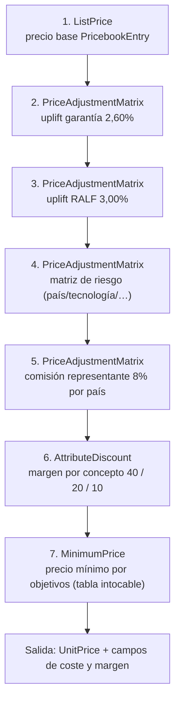

# 02 · Pricing y Escandallo (Salesforce Pricing)

> Sustituye la pestaña `ALL_Escandall` del Launcher: análisis de riesgos, costes por concepto, uplift de garantía, RALF, comisión de representante, márgenes por concepto, precio mínimo vs. precio de venta y calculadora de descuento.
>
> **Escenas:** 5 (líneas de intervención con precio/coste/margen), 6 (escandallo completo), 7 (add-on con su precio), 8 (descuento e impacto en margen).
> **Plan SFDMU:** `comexi-pricing`. **Referencia:** `datasets/sfdmu/qb/en-US/qb-pricing/` y `force-app/main/default/expressionSetDefinition/RLM_DefaultPricingProcedure`.

## 0. Corrección de modelo (crítica)

- **No existe un objeto `PricingProcedure`.** El pricing procedure es un registro de `ExpressionSet`, desplegado como `ExpressionSetDefinition` + `ExpressionSetDefinitionVersion`. `PricingProcedureResolution.PricingProcedureId` es un lookup a `ExpressionSet`.
- **El motor no tiene paso "coste" ni "margen".** El enum `PricingElementType` es cerrado: `ListPrice`, `AttributeDiscount`, `BundleDiscount`, `VolumeDiscount`, `VolumeTierDiscount`, `PriceAdjustmentMatrix`, `PromotionsDiscount`, `DerivedPricing`, `DiscountDistributionService`, `MinimumPrice`, `PriceRevision`, `RuleFetch`, `AssetDiscovery`. El **coste** es dato (`CostBook`/`CostBookEntry`); el **margen** se calcula y se **expone en campos** de `Quote`/`QuoteLineItem`.
- Por tanto, el escandallo de Comexi = pricing procedure con `ListPrice` + varios `PriceAdjustmentMatrix` (uplifts/riesgo/comisión) + `AttributeDiscount` (márgenes por concepto) + `MinimumPrice` (precio mínimo por objetivos), más campos custom para hacer visible coste y margen.

## 0.1 Prerrequisito de moneda: todo en EUR (crítico)

La org es multicurrency con **corporativa USD**, pero la demo cotiza en **EUR**. El discovery de catálogo y el pricing corren en la **moneda por defecto del usuario**, no en la de la quote, y el contexto de pricing arrastra también la moneda de la **Opportunity**. Si algún eslabón se queda en USD, el motor busca los `PricebookEntry` en USD, no encuentra ninguno y `Place Sales Transaction` falla con:

```
INVALID_API_INPUT: Could not find product with ID: <productId> from product
details fetched from ProductDiscovery Service.
```

Es un error engañoso: el producto **sí** está indexado y con precio; lo que falla es la resolución de precio en la moneda equivocada. Checklist, todo en EUR:

| Eslabón | Requisito | Verificación |
| :-- | :-- | :-- |
| Usuario que cotiza | `User.DefaultCurrencyIsoCode = 'EUR'` | `SELECT DefaultCurrencyIsoCode FROM User WHERE Id = :userId` |
| `PricebookEntry` | Solo EUR; **cero** PBE en USD para esos productos | `SELECT CurrencyIsoCode, COUNT(Id) FROM PricebookEntry WHERE ... GROUP BY CurrencyIsoCode` → una sola fila `EUR` |
| `CostBookEntry` | En EUR, para que el margen cuadre | idem sobre `CostBookEntry` |
| `Account` | `CurrencyIsoCode = 'EUR'` | — |
| `Opportunity` | `CurrencyIsoCode = 'EUR'` y `Pricebook2Id` informado | una Opportunity heredada en USD rompe la quote aunque la quote sea EUR |
| `Quote` | `CurrencyIsoCode = 'EUR'` | — |

Un PBE en USD conviviendo con el EUR no es inocuo: el discovery elige el corporativo y la línea rompe. Por eso `04_pricing_data.apex` **borra** los PBE/CBE que no sean EUR antes de insertar.

Tras recrear PBE (IDs nuevos) hay que refrescar las decision tables de pricing o el motor devuelve `prices: []` aunque la moneda ya sea correcta:

```bash
cci task run refresh_dt_default_pricing --org comexi   # incluye Price_Book_Entry_Decision_Table_v2
```

El refresh es asíncrono; esperar ~1-2 min antes de validar. Comprobación rápida de que el pricing responde:

```bash
sf api request rest /services/data/v67.0/connect/cpq/products/bulk --method POST \
  --body '{"productData":[{"productId":"<T100Id>"}],"priceBookId":"<stdPbId>","userContext":{"accountId":"<accId>"}}' \
  --target-org comexi
```

Debe devolver `prices` con `"currencyIsoCode": "EUR"` y el precio de lista. Ver también la skill `revenue-cloud-multicurrency-eur`.

## 1. Cifras de calibración (caso real 174535)

Todas leídas de pantalla; la demo debe reproducirlas.

| Concepto | Valor |
| :-- | :-- |
| Coste resultante | 4.923,49 € |
| Precio mínimo por objetivos | 7.186,78 € |
| Precio de venta (margen 42%) | 7.321,39 € |
| Precio final (−5% descuento) | **6.955,32 €** |
| Margen resultante | **27,54%** (1.915,76 €) |
| Uplift garantía | 2,60% (inicio desde aceptación, duración 6 meses) |
| Uplift RALF | 3,00% |
| Comisión de representante | 8% (solo países con representante) |
| Coste hora técnico | 56,00 € (fijado por Finanzas 1×/año) |
| Coste base manutención | 30,00 € |
| Total desplazamientos y estancia | 2.420,00 € (1 técnico, 3 noches, UK) |
| Add-on temperatura tinta | +3.600,00 € |
| Envío de piezas | 5.000–10.000 € según destino |

## 2. CostBook y CostBookEntry

El coste hora de técnico lo actualiza Finanzas una vez al año y no varía en el ejercicio (Ref. 38:21). Modelo natural: un cost book con entradas por producto.

### CostBook

| Name | IsDefault |
| :-- | :-- |
| `COMEXI Cost Book 2026` | true |

### CostBookEntry (extracto; una fila por producto con coste)

| Product (SKU) | Cost | Nota |
| :-- | :-- | :-- |
| `SRV-MEC` / `SRV-ELE` / `SRV-PME` / `SRV-PMR` / `SRV-PI` | 56,00 | coste hora técnico |
| `EXP-MEAL` | 30,00 | manutención base |
| `T100-*` (material) | leído de SAP | en demo: valores fijos que sumen ≈ coste de material del caso |
| `EXP-FLIGHT`/`EXP-HOTEL`/… | según caso | calibrar para total 2.420 € |

> El coste de material "se lee de SAP" en producción. En la demo se cargan valores fijos en `CostBookEntry` que, sumados a horas y gastos, den el **coste resultante 4.923,49 €**. La conexión viva a SAP es un gap de integración (ver [`06-pedido-dro-downpayment.md`](06-pedido-dro-downpayment.md)).

`Pricebook2.CostBookId` apunta a este cost book para que el procedure pueda leer el coste.

## 3. Pricebook2 y PricebookEntry

| Objeto | Config |
| :-- | :-- |
| `Pricebook2` | `COMEXI Retrofit Price Book`, `IsStandard=false`, `CostBookId → COMEXI Cost Book 2026` |
| `PricebookEntry` | una fila por (`Product2`, `ProductSellingModel=COMEXI_OneTime`) con `UnitPrice` = **precio base de lista** (antes de uplifts y márgenes) |

Precios base observados/derivados:

| SKU | UnitPrice base | Origen |
| :-- | :-- | :-- |
| `T100` (bundle base) | calibrar | precio de lista antes de escandallo |
| `T100-TEMP` | **3.600,00** | add-on citado literalmente (Ref. 59:18) |
| `SRV-*` | precio hora de venta | > coste 56 € para dejar margen |
| `EXP-*` | coste + margen bajo (10%) | Ref. "no hacer negocio con los billetes" |

> **Multidivisa:** gap del Discovery (¿facturan en divisa local?). Por defecto la demo usa una sola divisa. Si se confirma multidivisa, replicar `PricebookEntry` por `CurrencyIsoCode` (patrón `mfg-multicurrency`).

## 4. Pricing Procedure — `COMEXI_RetrofitPricingProcedure`

Registro de `ExpressionSet` desplegado como `ExpressionSetDefinition` en `force-app/main/default/expressionSetDefinition/COMEXI_RetrofitPricingProcedure/`. Clonar la estructura de `RLM_DefaultPricingProcedure` y añadir los pasos del escandallo.

### Secuencia de elementos (mapa escandallo → PricingElementType)



| # | Escandallo (columna del cliente) | PricingElementType | Fuente de datos |
| :-- | :-- | :-- | :-- |
| 1 | Precio base | `ListPrice` | `PricebookEntry.UnitPrice` |
| 2 | Uplift de garantía 2,60% | `PriceAdjustmentMatrix` | decision table `COMEXI_Warranty_Uplift` |
| 3 | Uplift RALF 3,00% | `PriceAdjustmentMatrix` | decision table `COMEXI_RALF_Uplift` |
| 4 | Análisis de riesgos (cliente, proveedor, país, tecnología, contexto, estandarización) | `PriceAdjustmentMatrix` | decision table `COMEXI_Risk_Matrix` |
| 5 | Comisión de representante 8% | `PriceAdjustmentMatrix` | decision table `COMEXI_Rep_Commission` (clave: país tiene representante) |
| 6 | Márgenes por concepto 40 / 20 / 10 | `AttributeDiscount` | por categoría de producto (ver §5) |
| 7 | Precio mínimo por objetivos (propuesta de mínimos, "tabla intocable") | `MinimumPrice` | objetivo de margen por producto |

### Context Definition

El procedure corre sobre `RLM_SalesTransactionContext` (extensión de `SalesTransactionContext__stdctx`) con `contextMapping: "QuoteEntitiesMapping"`. Registrar en `PricingActionParameters` (`contextDefinition`, `contextMapping`, `pricingProcedure`, `effectiveFrom`).

## 5. Márgenes por concepto (el corazón del escandallo)

Justificación del cliente (Ref. 39:40): *"no quiero hacer negocio a partir de los billetes de avión… si aplicas el margen grande a todo acabas con un precio invendible"*. Márgenes observados:

| Concepto / línea | Margen | Cómo se aplica |
| :-- | :-- | :-- |
| Producto principal (ETO1) | 40% | `AttributeDiscount` por categoría FAM_* |
| Comercialidad reducida | 20% | por categoría |
| Segundo producto (ETO2) | 10% | por categoría |
| Tercer producto (ETO3) | 10% | por categoría |
| Derivados y viajes (gastos) | 10% | categoría GASTOS |

El objetivo de margen por producto (equivalente a la columna `OBJECTIU M.C.` del catálogo, valores 10/25/40%) se guarda como campo custom `COMEXI_Target_Margin_Pct__c` en `Product2` y alimenta el paso `MinimumPrice`.

## 6. Decision tables

Cada `PriceAdjustmentMatrix` lee de una decision table. Se despliegan como metadata (patrón `unpackaged/pre/5_decisiontables/`) y se refrescan con la task `refresh_dt_*` (`POST /services/data/v66.0/actions/standard/refreshDecisionTable`).

| Decision table | Inputs (clave) | Output |
| :-- | :-- | :-- |
| `COMEXI_Warranty_Uplift` | (fijo) | 2,60% |
| `COMEXI_RALF_Uplift` | (fijo) | 3,00% |
| `COMEXI_Risk_Matrix` | Cliente, Proveedor, País, Tecnología, Contexto, Estandarización | % de ajuste |
| `COMEXI_Rep_Commission` | País (¿tiene representante?) | 8% / 0% |

Valores del caso real para `COMEXI_Risk_Matrix` (Ref. escandallo): cliente y proveedores = colaborador de confianza; país = América del Sur y Oceanía; tecnología = muy conocida; contexto = año normal; estandarización = opcional en cartera.

`PricingRecipe` + `PricingRecipeTableMapping` mapean las salidas del procedure a estas decision tables (patrón `configure_pricing_recipe_table_mappings`).

## 7. Campos custom para coste y margen (visibilidad)

Como el motor no expone margen, se añaden campos (deploy vía `force-app`, sobre objetos ya extendidos `Quote`/`QuoteLineItem`):

| Objeto | Campo | Tipo | Cálculo |
| :-- | :-- | :-- | :-- |
| `QuoteLineItem` | `COMEXI_Cost__c` | Currency | de `CostBookEntry` (vía procedure/flow) |
| `QuoteLineItem` | `COMEXI_Margin_Pct__c` | Percent | `(UnitPrice − Cost) / UnitPrice` |
| `QuoteLineItem` | `COMEXI_Target_Margin_Pct__c` | Percent | de `Product2.COMEXI_Target_Margin_Pct__c` |
| `Quote` | `COMEXI_Total_Cost__c` | Roll-up/Currency | suma de costes de líneas |
| `Quote` | `COMEXI_Blended_Margin_Pct__c` | Percent | margen global de la oferta |
| `Quote` | `COMEXI_Discount_Pct__c` | Percent | descuento aplicado (input del vendedor) |

`COMEXI_Blended_Margin_Pct__c` y `COMEXI_Discount_Pct__c` son la base de la deal guidance y la aprobación (ver [`04-quote-margen-aprobaciones.md`](04-quote-margen-aprobaciones.md)).

## 8. Attribute-based pricing (opcional, para retrofits con precio por atributo)

Si algún retrofit varía de precio según nº de CPUs/CUs: `AttributeBasedAdjRule` → `AttributeAdjustmentCondition` → `AttributeBasedAdjustment`. Reglas del motor:

- La picklist del atributo impactante debe ser `Text` (no `Number`) o rompe el hash.
- `IsPriceImpacting = true` **solo** en el `ProductAttributeDefinition`, `false` en los `ProductClassificationAttr`.
- Refrescar `Attribute_Based_Adjustment_Decision_Table` tras cargar los ajustes.
- Si el hash no casa, no aplica ajuste y **no da error** (verificar en la waterfall).

## 9. Despliegue y verificación

1. Cargar `comexi-pricing` (SFDMU): cost book, price book, entries, adjustment schedules.
2. Desplegar `COMEXI_RetrofitPricingProcedure` (`activate_and_deploy_expression_sets`).
3. Configurar `PricingActionParameters` y `PricingRecipeTableMapping`.
4. Refrescar decision tables (`refresh_dt_default_pricing` + las `COMEXI_*`).
5. Verificar la **waterfall** (`GET /connect/core-pricing/waterfall/{lineItemId}/{executionId}`): que el T100 con 5% de descuento dé 6.955,32 € y margen 27,54%.

> El pricing se dispara vía `PlaceQuote` o `POST /connect/core-pricing/pricing`. Nunca escribir `PricebookEntry` por API en runtime.
