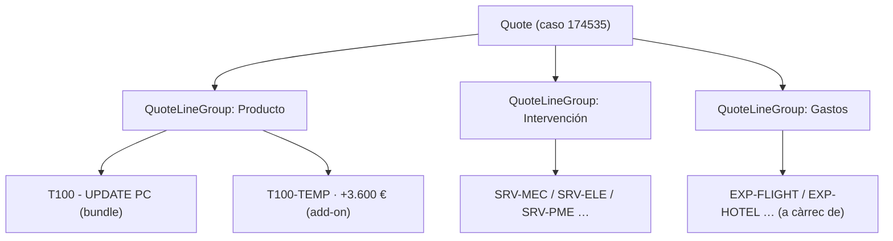

# 04 · Quote, Margen y Aprobaciones (Transaction Management)

> Sustituye la pestaña `SYS_Launcher` (montaje del proyecto en slots DTO/ETO/CTC), la calculadora de descuento de `ALL_Escandall` y las aprobaciones verbales por WhatsApp/Hangouts.
>
> **Escenas:** 3 (oportunidad), 5 (grupos de líneas), 7 (add-on), 8 (descuento + aprobación con traza).
> **Referencia:** clases `RLM_PlaceQuoteModel`, `RLM_PlaceOrderModel`, bundle `unpackaged/post_approvals`, plan `qb-approvals`.

## 1. Record types de Opportunity

Mantener el vocabulario del cliente: tres tipos de oportunidad con reportes propios (Ref. 14:54–16:01).

| Record Type | DeveloperName | Uso |
| :-- | :-- | :-- |
| Comercial | `COMEXI_Comercial` | venta de máquina nueva (PLM) |
| Retrofitting | `COMEXI_Retrofitting` | paquete sobre máquina instalada — **el de la demo** |
| Servicio | `COMEXI_Servicio` | packs gold/silver |

La escena 3 crea la Opportunity `COMEXI_Retrofitting` desde el Case, asociada a Account + Asset + Case. Implementar con un quick action / flow sobre el Case (patrón `RLM_Create_New_Quote`).

## 2. Quote con QuoteLineGroup (precio desglosado)

`QuoteLineGroup` (v61.0+) resuelve la **prioridad nº 2 del cliente** (precios desglosados). Tres grupos que reproducen la estructura del escandallo:



| Grupo | QuoteLineGroup.Name | Contenido |
| :-- | :-- | :-- |
| Producto | `Producto` | bundle T100 + add-on de tinta |
| Intervención | `Intervención` | líneas `SRV-*` (horas) |
| Gastos | `Gastos` | líneas `EXP-*` con `COMEXI_Charged_To` |

El **add-on** `T100-TEMP` es una línea independiente (no componente del bundle), lo que permite mostrar "precio básico + 3.600 € más" (escena 7). Para comparar escenarios, generar una **alternativa** (segunda Quote asociada a la misma Opportunity, o clone de la Quote).

## 3. Creación de la Quote: PlaceQuote (nunca DML directo)

> **Regla dura:** nunca `INSERT Quote` / `INSERT QuoteLineItem` por DML. El motor de pricing no se dispara y aparece el banner naranja "The prices aren't up to date". El Instant Pricing API server-side tampoco lo resuelve.

Usar una de estas dos vías:

### Apex (recomendado; reutiliza `RLM_PlaceQuoteModel`)

```apex
PlaceQuote.PlaceQuoteRLMApexProcessor.execute(
    PlaceQuote.PricingPreferenceEnum.System,   // dispara pricing
    graph,                                       // grafo Quote + líneas + grupos
    PlaceQuote.ConfigurationInputEnum.RunAndAllowErrors,
    configOpts
);
```

- Referencias entre registros del grafo: `'@{refQuote.id}'`.
- `PricingPreferenceEnum.System` para que corra el pricing procedure `COMEXI_RetrofitPricingProcedure`.

### REST

```
POST /services/data/v66.0/commerce/quotes/actions/place
```

Respuesta async → `statusURL` a `/sobjects/AsyncOperationTracker/{id}`.

## 4. Deal guidance por umbral de margen

La lógica del cliente (Ref. 42:38): *"mientras el margen quede por encima del mínimo no hace falta aprobación; por debajo, sí"*. Se implementa con guía de negociación sobre los campos de margen definidos en [`02-pricing-escandallo.md`](02-pricing-escandallo.md) §7:

- `Quote.COMEXI_Blended_Margin_Pct__c` — margen resultante de la oferta.
- `Product2.COMEXI_Target_Margin_Pct__c` / umbral mínimo por producto.
- Regla: si `COMEXI_Blended_Margin_Pct__c < umbral_mínimo` → requiere aprobación.

La guía avisa **antes** de pedir la aprobación (escena 8: "enseñamos la guía de negociación que avisa antes"). Implementar como validación/flow sobre la Quote que muestra el aviso en la pantalla de negociación.

## 5. Proceso de aprobación con histórico

Sustituye WhatsApp/Hangouts por un approval con traza completa (dolor **D3**, crítico).

| Elemento | Config |
| :-- | :-- |
| Objeto | `Quote` |
| Criterio de entrada | `COMEXI_Discount_Pct__c` por encima de X **o** margen bajo umbral |
| Aprobador | Director de servicio (tras reorg del 1 sep — **gap**, ver 09) |
| Registro | fecha, persona, comentario, motivo (histórico nativo de approvals) |
| Notificación | in-app / email (patrón `ApprovalAlertContentDef` del plan `qb-approvals`) |
| UI componible | bundle `unpackaged/post_approvals` (classes, flexipages, flows, pathAssistants) |

En la demo, el caso 174535 con 5% de descuento cae bajo el umbral → dispara aprobación → el director aprueba con comentario → queda auditado. Contraste explícito: *"con el histórico que hoy simplemente no existe porque se aprueba por WhatsApp"*.

## 6. Datos que este dominio no carga por SFDMU

La Quote y sus líneas **no** se cargan con SFDMU (romperían el pricing). Se generan:

- En **seed** ([`08-seed-data.md`](08-seed-data.md)) vía `PlaceQuote` para arrancar la demo con una cotización lista.
- O en vivo durante la demo (escenas 4–8) mediante el configurador + PlaceQuote.

El plan `comexi-approvals` (opcional) puede cargar `ApprovalAlertContentDef` + `EmailTemplate` como readonly, igual que `qb-approvals`.

## 7. Verificación

- Crear la Quote del caso real vía PlaceQuote y comprobar que **no** aparece el banner naranja.
- Ver los tres grupos en la Transaction Line Editor.
- Aplicar 5% → margen 27,54% → dispara aprobación → aprobar → verificar el registro en el histórico de aprobación.
