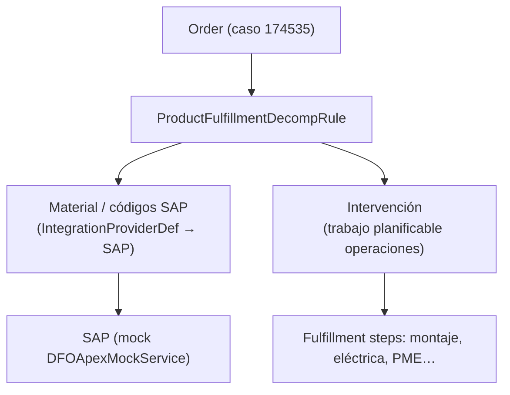

# 06 · Pedido, DRO y Down Payment (Order + Orchestration + Billing)

> Sustituye la oferta en paralelo dentro de SAP, la conversión manual de oferta a pedido, el menú `Entrada Comanda` / `Notificar Comanda` / `Generar FUMA` y el seguimiento del down payment por correo.
>
> **Escena:** 11 (pedido, descomposición y down payment).
> **Referencia:** invocable `createOrderFromQuote`, plan `qb-dro`, clases `RLM_PlaceOrderModel` / `RLM_DetermineDROSourceType`, mock `DFOApexMockService`, flow `RLM_CreateOrdersFromQuote`, contexto `RLM_FulfillmentAssetContext`.

## 1. Quote → Order

El contrato firmado (o la Quote aceptada) genera el pedido:

```
POST /services/data/v66.0/actions/standard/createOrderFromQuote
{ "inputs": [{ "quoteId": "<QuoteId>" }] }
```

- Reutilizar el flow `RLM_CreateOrdersFromQuote` y `RLM_Submit_Order_on_Activation`.
- Elimina la doble entrada en SAP y la conversión manual (dolor **D6**).

## 2. Descomposición DRO

El pedido se descompone en dos destinos: **material → SAP**, **intervención → operaciones** (dolor **D6**, Ref. 52:00–53:27).



### ProductFulfillmentDecompRule

| Campo | Valor |
| :-- | :-- |
| `Name` | `COMEXI_T100_Decomp` |
| `SourceProductId` | `T100` |
| `DestinationProductId` | códigos de material SAP (uno por componente) / productos de servicio |

Reglas de descomposición del T100:

| Origen | Destino | Ruta |
| :-- | :-- | :-- |
| Componentes del bundle (T100-*) | códigos de material SAP | integración SAP |
| Líneas de intervención (SRV-*) | tareas planificables | operaciones |

`ValTfrmGrp` / `ValTfrm` para mapear valores de atributo a códigos de material si aplica.

### FulfillmentStepDefinition (intervención)

Un `FulfillmentStepDefinitionGroup` con pasos y dependencias que reproducen el cronograma de intervención (Ref. 35:57, hasta 6 semanas):

| Step | Depende de | Rol/Cola |
| :-- | :-- | :-- |
| `Envío de material` | — | integración SAP |
| `Muntatge mecànic` | Envío de material | operaciones |
| `Instal·lació elèctrica` | Muntatge mecànic | operaciones |
| `Posada en marxa (PME)` | Instal·lació elèctrica | ingeniería |
| `Proves d'aplicacions` | PME | operaciones |

`FulfillmentStepDependencyDef` encadena los pasos. `FulfillmentStepJeopardyRule` para SLA si se quiere mostrar tracking.

### Integración SAP (mock)

- `IntegrationProviderDef` apuntando a un servicio SAP.
- En la demo: **mock** con `DFOApexMockService` (ya en el repo) — no hay integración SAP real (gap declarado; el middleware actual es una pregunta abierta del Discovery).

## 3. Down payment (Billing)

El down payment es la condición para que ingeniería arranque (Ref. 55:40): *"ingeniería no trabaja hasta que Finanzas confirma el cobro, con excepciones autorizadas"*.

Modelo: `BillingMilestonePlan` + `BillingMilestonePlanItem` (v63.0+) con un hito de pago inicial.

| Objeto | Config |
| :-- | :-- |
| `BillingMilestonePlan` | plan con hito "Down payment" (% del total) |
| `BillingMilestonePlanItem` | hito inicial ligado a la aceptación del pedido |
| `BillingSchedule` | referencia al Order |

- **Gating de ingeniería:** el paso `Posada en marxa (PME)` (ingeniería) depende de la confirmación del cobro del down payment. Modelar como dependencia del fulfillment step sobre el estado del billing milestone, o como criterio de entrada del paso.
- **Excepción autorizada:** un responsable puede autorizar el arranque sin cobro dejando registro (campo/flow de override con auditoría).

> La activación de billing sigue el patrón `activateBillingRecords.apex` + `activateDefaultPaymentTerm.apex` (flags `billing: true`, ya activo en el repo).

## 4. Gestión de cambios post-pedido (D13, fuera del flujo principal)

Si el cliente modifica o cancela alcance tras confirmar (Ref. 56:59, "enviar correos e improvisad"): **change orders** sobre el pedido con recálculo de precio y reorquestación de la parte no ejecutada. No se demuestra en el hilo principal; se menciona como capacidad.

## 5. Plan SFDMU `comexi-dro`

Clonar `qb-dro`: `ProductFulfillmentDecompRule`, `ValTfrmGrp`, `ValTfrm`, `FulfillmentStepDefinition(+Group,+DependencyDef)`, `ProductFulfillmentScenario`, `FulfillmentWorkspace(+Item)`, `FulfillmentFalloutRule`, `FulfillmentStepJeopardyRule`, `FulfillmentTaskAssignmentRule`.

## 6. Verificación

1. `createOrderFromQuote` sobre la Quote del caso 174535 → Order creado.
2. Verificar la descomposición: líneas de material marcadas hacia SAP (mock), líneas de intervención como fulfillment steps.
3. Comprobar el hito de down payment y que el paso de ingeniería está bloqueado hasta la confirmación.
4. Simular confirmación de cobro → el paso de ingeniería se desbloquea.
