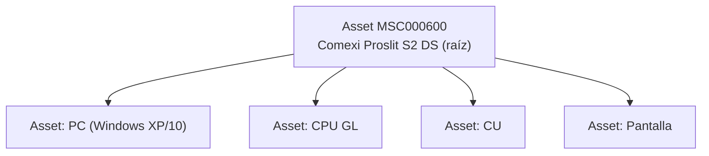

# 07 · Assets, Agentforce y Dashboards

> Cubre las tres piezas que resuelven las prioridades declaradas por el cliente: la **base instalada** como fuente de viabilidad (prioridad 1), el **agente** que sustituye a `=GEMINI()` con traza (prioridad 1), y los **dashboards** (prioridad 3). Sustituye la nomenclatura dispersa (SAP + PLM + Excels), la función `=GEMINI()` en celda y el registro de ofertas/pedidos hecho a mano.
>
> **Escenas:** 1 (Asset como objeto de primera clase), 2 (agente de viabilidad), 12 (Asset se actualiza), 13 (dashboards), 14 (agente proactivo sobre base instalada).
> **Referencia:** bundle `unpackaged/post_agents` (agentes NGA en `aiAuthoringBundles/`), contextos `RLM_AssetContext` / `RLM_FulfillmentAssetContext`, flows `RLM_Assetize_Order` / `RLM_Set_Asset_Parent_From_Relationship`, clase `RLM_AssetInfoUtility`, task `refresh_dt_asset`, skill `agentforce-development`.

## 1. Base instalada (Asset Lifecycle Management)

La máquina es un objeto de primera clase, no una matrícula en una celda (dolor **D8**). Jerarquía: la máquina es el Asset raíz; sus componentes (PC, CPU, CU, pantalla) son Assets hijos.

### Campos custom en Asset (alimentan viabilidad y agente)

27 campos `COMEXI_*` agrupados en cuatro secciones de la pestaña Detalles. Las secciones y los dos LWC de la escena 01 los genera `scripts/apex/comexi/22_add_comexi_asset_sections.py` sobre `Asset-Asset Layout` y `RLM_Asset_Record_Page`; el perfil de las dos máquinas del parque lo sella `scripts/apex/comexi/22_asset_technical_profile.apex`.

**Ficha técnica de la máquina**

| Campo | Tipo | Uso |
| :-- | :-- | :-- |
| `COMEXI_Machine_Model__c` | Text | "Proslit S2 DS" — clave de cualificación |
| `COMEXI_Install_Year__c` | Number | antigüedad → multiplicador de coste (x3/x4 en máquinas antiguas) |
| `COMEXI_Machine_Age_Years__c` | Formula (Number) | `YEAR(TODAY()) - COMEXI_Install_Year__c`; no se desfasa entre pases de la demo |
| `COMEXI_Line__c` | Text | línea de máquina (T, L, C, P) |
| `COMEXI_Installed_Config__c` | Long Text | componentes y versiones (p. ej. Windows XP) |
| `COMEXI_Control_System__c` | Text | "Simotion GL + Sinamics" — clave de compatibilidad del T100 |
| `COMEXI_SAP_Equipment_Code__c` | Text | matrícula con la que la máquina existe en SAP |
| `COMEXI_Web_Width_mm__c` | Number | ancho de banda útil |
| `COMEXI_Stations__c` | Number | cuerpos de impresión o husillos de corte |
| `COMEXI_Max_Speed_Mpm__c` | Number | velocidad máxima de ficha técnica |

**Obsolescencia y viabilidad** — es la sección que respalda el veredicto del Advisor (escena 2) y la priorización de la campaña (escena 14)

| Campo | Tipo | Uso |
| :-- | :-- | :-- |
| `COMEXI_OS_Installed__c` | Picklist | Windows XP / 7 / 10 / 11 / No aplica |
| `COMEXI_OS_Support_End__c` | Date | convierte la obsolescencia en fecha accionable |
| `COMEXI_Obsolete_Component__c` | Text | componente que dispara el retrofit |
| `COMEXI_Obsolescence_Risk__c` | Picklist | Crítico / Alto / Medio / Bajo — orden del preestudio masivo |
| `COMEXI_Retrofit_Eligible__c` | Checkbox | si está desmarcado la salida es máquina nueva, no retrofit |
| `COMEXI_Requires_Engineering__c` | Checkbox | separa el veredicto de `MSC000600` del de `MSC000123` |
| `COMEXI_Recommended_Retrofit_SKU__c` | Text | SKU validado contra catálogo (antídoto al "Codi P271 no trobat") |

**Servicio e histórico**

| Campo | Tipo | Uso |
| :-- | :-- | :-- |
| `COMEXI_Service_Level__c` | Picklist | Gold / Silver / Bronze / Sin contrato (gap de packs del Discovery) |
| `COMEXI_Last_Intervention_Date__c` | Date | relación de servicio de la máquina, no de la cuenta |
| `COMEXI_Intervention_Count__c` | Number | histórico explotable, no dato muerto (D8) |
| `COMEXI_Operating_Hours__c` | Number | desgaste real que la antigüedad sola no captura |
| `COMEXI_Service_Revenue_Lifetime__c` | Currency | ingresos de servicio acumulados sobre la máquina |
| `COMEXI_Open_Cases__c` | Number | casos abiertos. No es rollup: `Case` no es detalle de `Asset` |

**Retrofit y emplazamiento**

| Campo | Tipo | Uso |
| :-- | :-- | :-- |
| `COMEXI_Site_Location__c` | Text | "Leeds, United Kingdom" — riesgo país, gastos y ventana de intervención |
| `COMEXI_Retrofits_Applied__c` | Text | SKUs ya aplicados; evita recomendar dos veces lo mismo |
| `COMEXI_Last_Retrofit_Date__c` | Date | cierra el ciclo de la escena 12 |
| `COMEXI_Retrofit_Potential_Value__c` | Currency | convierte la escena 14 en pipeline cuantificado |

### UI de la escena 01 sobre el Asset

Dos LWC en la región principal de `RLM_Asset_Record_Page`, encima del tabset y en orden de lectura. Ambos leen de `COMEXI_AssetOverviewController`, que responde con una query por objeto (la máquina y sus assets hijos salen de la misma consulta `Id = :assetId OR ParentId = :assetId`).

| Componente | Qué hace |
| :-- | :-- |
| `comexiAssetCaseAlert` | Banda roja de ancho completo: avisa del caso de servicio abierto, cita la petición literal del cliente y salta al caso 174535 con el que arranca la demo. No renderiza nada cuando la máquina no tiene casos abiertos |
| `comexiAssetMachineCard` | Ficha visual: foto real resuelta desde el SKU contra `COMEXI_MachineryImages`, placa de identificación, ficha técnica, cuatro KPI de servicio, banda de obsolescencia con veredicto de viabilidad, configuración instalada componente a componente con el PC marcado en riesgo, e historial de la máquina con sus casos reales |

Lo único simulado es el timeline de ciclo de vida (`mockData.js` del componente), que se mantiene aparte y comentado para poder decir en la demo qué parte de la pantalla es dato de plataforma. Cuando Comexi cargue su histórico de servicio, ese timeline pasa a salir de `WorkOrder` y el fichero desaparece.

### Ciclo de vida (escena 12)

Cerrada la instalación, el Asset refleja la nueva configuración (el PC pasa a Windows 11). Trazabilidad nativa:

- `Asset` ← `AssetAction` (`ActionType` = New/Amend/Renew/Cancel) ← `AssetActionSource` (`OrderItemId`).
- `OrderItem.OriginalOrderItemId` para enmiendas.
- Se genera automáticamente al activar el pedido con `RLM_Assetize_Order` / `RLM_Assetize_Order_DRO_Fulfillment` (reutilizables). `refresh_dt_asset` mantiene la decision table de assets.

`RLM_Set_Asset_Parent_From_Relationship` construye la jerarquía máquina + componentes.

## 2. Agentforce — `COMEXI_Retrofit_Advisor` (NGA / Agent Builder 2.0)

> Antes de construir, leer la skill `agentforce-development` (`~/.cursor/skills/agentforce-development/SKILL.md`) y seguir el workflow de 10 fases. Delegar en el subagente `agentforce-builder`. Bundle base: `unpackaged/post_agents/aiAuthoringBundles/` (patrón NGA con Builder Script).

Sustituye la función `=GEMINI()` (Ref. 32:52–33:44): agéntica, con traza, y **sin poder inventar códigos** (validación contra catálogo real; el caso "Codi P271 no trobat" visto en 32:30 no puede pasar).

### Topics del agente

| Topic | Qué hace | Escena |
| :-- | :-- | :-- |
| `Viabilidad` | Lee el Case + Asset, ejecuta la cualificación (`RLM_ProductQualification`), devuelve veredicto (viable / requiere ingeniería) **con el porqué** | 2 |
| `Recomendación` | Cruza la petición del cliente con el catálogo y recomienda producto (T100 - UPDATE PC), validando que el SKU exista | 2 |
| `Preestudio masivo` | Recorre la base instalada, detecta máquinas afectadas por obsolescencia de componente y propone campaña de retrofit con oferta preconfigurada por máquina | 14 |

### Actions (grounding sobre datos estructurados)

- Retrieve del `Asset` y su configuración (`RLM_AssetInfoUtility`).
- Retrieve del catálogo (`Product2`, categorías) para recomendar solo SKUs existentes.
- Invocación de la cualificación de producto.
- (Escena 14) Query sobre la base instalada por modelo/componente obsoleto.

### Trust Layer y agnosticismo de LLM (dolor D12)

- El agente corre sobre datos estructurados de la plataforma con **Einstein Trust Layer** (masking, grounding auditable) — responde a su preocupación de "cuando utilizamos otras herramientas perdemos el control".
- **Agnóstico de modelo:** pueden mantener Gemini como LLM. Mensaje de la escena 14: la agéntica necesita datos estructurados, no un Excel.
- **Guardrails de IA:** gap del Discovery (quedó sin responder en la sesión). Declararlo y usar el Trust Layer como argumento diferencial.

## 3. Reports y Dashboards (prioridad 3)

Sustituye el registro de ofertas y de pedidos que construyen a mano (dolor **D9**, Ref. 1:00:27). Su primer criterio de éxito declarado: visibilidad y transparencia.

### KPIs / componentes del dashboard

| KPI | Fuente | Objeto |
| :-- | :-- | :-- |
| Tiempo medio de cotización | fecha creación → aceptación Quote | Quote |
| Tasa de conversión oferta → pedido | Quotes vs. Orders | Quote / Order |
| Margen medio por familia de producto | `COMEXI_Blended_Margin_Pct__c` por categoría | Quote / QuoteLineItem |
| Descuento medio | `COMEXI_Discount_Pct__c` | Quote |
| Ofertas pendientes de aprobación | estado de approval | Quote |
| Pipeline de retrofit por línea de máquina y país | Opportunity Retrofitting por `COMEXI_Line__c` + país | Opportunity / Asset |

Se construyen como `Report` + `Dashboard` nativos (metadata en `force-app`), sobre los objetos estándar. Reutilizar el flow `prepare_analytics` como base.

### Paleta del LWC `comexiRevenueDashboard`

Los tokens de color del componente (`comexiRevenueDashboard.css`, bloque `:host`) siguen la marca Comexi muestreada del logo oficial, la misma que las imágenes de catálogo ([`01-catalogo-atributos.md`](01-catalogo-atributos.md) §4).

| Token | Valor | Uso |
| :-- | :-- | :-- |
| `--c-brand` | `#455560` | Antracita del wordmark: estructura, embudo, tendencia, barras neutras |
| `--c-brand-2` | `#6b7a87` | Antracita claro, segundo color de los degradados |
| `--c-accent` | `#ed1848` | Rojo del símbolo: pestaña activa, enlaces, ranking, total del escandallo |
| `--c-accent-bg` / `--c-accent-border` | `#fdf1f4` / `#f7ccd7` | Tintes de acento: franja de drill-down y estados hover |

El rojo queda reservado a acentos de marca para no competir con los colores semánticos de margen (`--c-good` verde, `--c-warn` ámbar, `--c-bad` rojo ladrillo), que son los que el usuario debe leer como señal. La paleta de familias del donut (`mockData.js`) usa los mismos tres rojos que los acentos de las imágenes: `#ed1848` para `T`, `#b01136` para `L` y `#7a142e` para `C`.

## 4. Despliegue y verificación

1. Desplegar campos custom de Asset, secciones y LWC de la escena 01: `cci task run deploy_post_comexi`.
2. Cargar la base instalada en seed ([`08-seed-data.md`](08-seed-data.md)) y sellar el perfil técnico con `sf apex run -f scripts/apex/comexi/22_asset_technical_profile.apex`.
3. `refresh_dt_asset` para la cualificación.
4. Desplegar el agente (bundle `post_agents`, patrón NGA) — seguir `agentforce-development` y testear con `sf agent preview` (skill `agentforce-test`).
5. Desplegar reports/dashboards.
6. Verificar:
   - Escena 2: el agente recomienda T100 sobre el caso 174535 y da veredicto viable con explicación; sobre la máquina antigua da "requiere ingeniería".
   - Escena 12: activar el pedido → el Asset MSC000600 refleja Windows 11 con `AssetAction`/`AssetActionSource`.
   - Escena 14: el agente lista máquinas con componente obsoleto y propone campaña.
   - Escena 13: el dashboard muestra los KPIs con datos de la demo.
