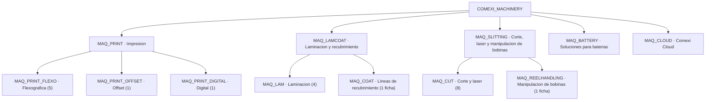

# 10 · Catálogo Comexi Maquinaria

> Segundo `ProductCatalog` (`COMEXI_MACHINERY`) que convive con `COMEXI_SERVICE` sin tocarlo. Reproduce la sección **"Qué ofrecemos"** de [comexi.com](https://comexi.com/es/): 12 categorías, 23 modelos reales con su ficha técnica como atributos PCM nativos, fotos reales de la web, y precios orientativos (placeholder) para que sean cotizables.

Se construye con cuatro scripts de Apex anónimo idempotente bajo `rlm-base-dev/scripts/apex/comexi/`, clonando el patrón de `01_catalog` → `04_pricing_data`. Todo lo nuevo va prefijado para no colisionar con el catálogo de retrofit: categorías `MAQ_*`, SKU `MAQ-*`, clasificaciones `PC_MAQ_*`, atributos `COMEXI_MAQ_*`.

## Reglas de fidelidad a la fuente

1. **`CatalogType = 'Sales'`.** El picklist solo admite `Sales` y `ServiceProcess`; "maquinaria" queda en el nombre y las categorías.
2. **Valores literales.** Las especificaciones se transcriben tal cual de la web, con sus erratas (`"3310 inch"`, `"1640 in/min"`, `"Digifelx"`). Solo se normalizan los **nombres** de atributo, no los valores.
3. **Ficha ampliada primero.** Cuando la página del modelo tiene ficha más completa que la tarjeta de categoría, se usa la del modelo.
4. **Variantes → `Description`.** En modelos con variantes (F2 ML, S1 DT, S1 DS, Energy Winders) los atributos toman la variante base y la matriz completa va en `Product2.Description`.
5. **Precios placeholder.** Comexi no publica precios; los importes son orientativos y redondos, marcados como placeholder.

## 1. ProductCatalog

| Campo | Valor |
| :-- | :-- |
| Code | `COMEXI_MACHINERY` |
| Name | `Comexi Maquinaria` |
| CatalogType | `Sales` |
| EffectiveStartDate | `2020-01-01` |

## 2. Categorías (12, espejo del menú web)

| Code | Name | Padre |
| :-- | :-- | :-- |
| `MAQ_PRINT` | Impresión | — |
| `MAQ_PRINT_FLEXO` | Máquinas de impresión flexográfica | `MAQ_PRINT` |
| `MAQ_PRINT_OFFSET` | Máquinas de impresión offset | `MAQ_PRINT` |
| `MAQ_PRINT_DIGITAL` | Máquinas de impresión digital | `MAQ_PRINT` |
| `MAQ_LAMCOAT` | Laminación y recubrimiento | — |
| `MAQ_LAM` | Máquinas de laminación | `MAQ_LAMCOAT` |
| `MAQ_COAT` | Líneas de recubrimiento | `MAQ_LAMCOAT` |
| `MAQ_SLITTING` | Corte, láser y manipulación de bobinas | — |
| `MAQ_CUT` | Soluciones de corte y láser | `MAQ_SLITTING` |
| `MAQ_REELHANDLING` | Manipulación de bobinas | `MAQ_SLITTING` |
| `MAQ_BATTERY` | Soluciones para baterías | — |
| `MAQ_CLOUD` | Comexi Cloud | — |

## 3. ProductClassification (8, para agrupar atributos por familia)

| Code | Name | Categoría de atributo |
| :-- | :-- | :-- |
| `PC_MAQ_FLEXO` | Impresora flexográfica | `MAQ_PRINTING` |
| `PC_MAQ_OFFSET` | Impresora offset | `MAQ_PRINTING` |
| `PC_MAQ_DIGITAL` | Impresora digital | `MAQ_PRINTING` |
| `PC_MAQ_LAMINATOR` | Laminadora | `MAQ_LAMINATING` |
| `PC_MAQ_SLITTER` | Cortadora rebobinadora | `MAQ_SLITTING` |
| `PC_MAQ_LASER` | Sistema láser | `MAQ_LASER` |
| `PC_MAQ_BATTERY` | Solución para baterías | `MAQ_BATTERY` |
| `PC_MAQ_SOLUTION` | Solución a medida | — (sin atributos) |

## 4. Atributos (AttributeDefinition, `DataType = Text`)

Todos con prefijo `COMEXI_MAQ_`. Categorías de atributo: `MAQ_PRINTING`, `MAQ_LAMINATING`, `MAQ_SLITTING`, `MAQ_LASER`, `MAQ_BATTERY`.

| DeveloperName | Label | Cat. atributo |
| :-- | :-- | :-- |
| `COMEXI_MAQ_Speed` | Speed | (compartido) |
| `COMEXI_MAQ_Colours` | Colours | MAQ_PRINTING |
| `COMEXI_MAQ_WebWidth` | Web width | MAQ_PRINTING |
| `COMEXI_MAQ_PrintingWidth` | Printing width | MAQ_PRINTING |
| `COMEXI_MAQ_MinRepeat` | Minimum repeat | MAQ_PRINTING |
| `COMEXI_MAQ_MaxRepeat` | Maximum repeat | MAQ_PRINTING |
| `COMEXI_MAQ_Inks` | Inks | MAQ_PRINTING |
| `COMEXI_MAQ_Resolution` | Resolution | MAQ_PRINTING |
| `COMEXI_MAQ_NumberOfLines` | Number of lines | MAQ_PRINTING |
| `COMEXI_MAQ_MaterialThickness` | Material thickness | MAQ_PRINTING |
| `COMEXI_MAQ_Dimensions` | Dimensions | MAQ_PRINTING |
| `COMEXI_MAQ_Adhesive` | Adhesive | MAQ_LAMINATING |
| `COMEXI_MAQ_MaxReelDiameter` | Max. reel diameter | MAQ_LAMINATING |
| `COMEXI_MAQ_MaxReelWeight` | Max. reel weight | MAQ_LAMINATING |
| `COMEXI_MAQ_UWWebTension` | UW web tension | MAQ_LAMINATING |
| `COMEXI_MAQ_RWWebTension` | RW web tension | MAQ_LAMINATING |
| `COMEXI_MAQ_AutReelChange` | Aut. reel change | MAQ_LAMINATING |
| `COMEXI_MAQ_MaterialWidth` | Material width | MAQ_SLITTING |
| `COMEXI_MAQ_ParentRoll` | Parent roll diameter & weight | MAQ_SLITTING |
| `COMEXI_MAQ_WebPath` | Web path | MAQ_SLITTING |
| `COMEXI_MAQ_SlittingWidth` | Slitting width | MAQ_SLITTING |
| `COMEXI_MAQ_RewindingSystem` | Rewinding system | MAQ_SLITTING |
| `COMEXI_MAQ_FinishedRollDiameter` | Finished roll diameter | MAQ_SLITTING |
| `COMEXI_MAQ_AccelerationRamps` | Acceleration ramps | MAQ_SLITTING |
| `COMEXI_MAQ_TurretRotation` | Turret rotation | MAQ_SLITTING |
| `COMEXI_MAQ_RewinderSystemType` | Type of rewinder system | MAQ_SLITTING |
| `COMEXI_MAQ_MaxInputReelOD` | Max. input reel OD | MAQ_SLITTING |
| `COMEXI_MAQ_MaxOutputReelOD` | Max. output reel OD | MAQ_SLITTING |
| `COMEXI_MAQ_SpliceTable` | Splice table | MAQ_SLITTING |
| `COMEXI_MAQ_BothDirRewinding` | Both directions rewinding | MAQ_SLITTING |
| `COMEXI_MAQ_MaxRewinderWeight` | Max. rewinder weight | MAQ_SLITTING |
| `COMEXI_MAQ_LaserPower` | Laser Power | MAQ_LASER |
| `COMEXI_MAQ_LaserHeads` | Laser heads | MAQ_LASER |
| `COMEXI_MAQ_Wavelength` | Wavelength | MAQ_LASER |
| `COMEXI_MAQ_SpotSize` | Spot Size | MAQ_LASER |
| `COMEXI_MAQ_LaserSource` | Laser source | MAQ_LASER |
| `COMEXI_MAQ_CoolingSystem` | Cooling system | MAQ_LASER |
| `COMEXI_MAQ_FoilThickness` | Foil thickness | MAQ_BATTERY |
| `COMEXI_MAQ_CoatingThickness` | Coating thickness | MAQ_BATTERY |
| `COMEXI_MAQ_RewinderType` | Rewinder type | MAQ_BATTERY |
| `COMEXI_MAQ_SlittingMethod` | Slitting method | MAQ_BATTERY |
| `COMEXI_MAQ_QuickKnives` | Quick knives changeover | MAQ_BATTERY |
| `COMEXI_MAQ_MaxBurrSize` | Max. burr size | MAQ_BATTERY |
| `COMEXI_MAQ_SlittingAlignment` | Slitting alignment | MAQ_BATTERY |
| `COMEXI_MAQ_ReelDiameter` | Reel diameter | MAQ_BATTERY |
| `COMEXI_MAQ_MaximumWidth` | Maximum width | MAQ_BATTERY |
| `COMEXI_MAQ_InsideCoreDiameter` | Inside core diameter | MAQ_BATTERY |

Normalización de nombres de la web (mismo concepto, nombre distinto): `Adhesive` ← "Type of adhesive"; `Max. input reel OD` ← "Max. incoming reel OD"; `Speed` ← "Maximum speed" / "Web material speed"; `Web width` ← "Reel width" / "Max. web width" (impresión/doctor); `Printing width` ← "Max. printing width" / "Max printing width".

## 5. Modelos (23 + 3 fichas de solución)

Precio en EUR (placeholder); coste = 70 % del precio; margen objetivo 30 %.

### 5.1 Flexográfica — `MAQ_PRINT_FLEXO` / `PC_MAQ_FLEXO`

| SKU | Name | Precio |
| :-- | :-- | --: |
| `MAQ-F1-EVO` | Comexi F1 Evolution | 2.400.000 |
| `MAQ-F2-ML` | Comexi F2 ML | 1.600.000 |
| `MAQ-F2-ORIGIN` | Comexi F2 Origin | 1.200.000 |
| `MAQ-F2-MB` | Comexi F2 MB | 1.100.000 |
| `MAQ-F4-ORIGIN` | Comexi F4 Origin | 900.000 |

- **MAQ-F1-EVO** — Colours `10/8` · Speed `600 m/min` · Web width `1320 - 1520 - 1720 mm` · Minimum repeat `400-450 mm` · Maximum repeat `920 - 1260 mm`
- **MAQ-F2-ML** — Colours `8 / 10` · Speed `400 / 500 m/min` · Printing width `870/1070/1270/1470 mm` · Minimum repeat `330/350/380/400 mm` · Maximum repeat `1160 mm` · Description: variantes F2 MB / F2 MP / F2 ML
- **MAQ-F2-ORIGIN** — Colours `8` · Speed `400 m/min` · Printing width `870/1070/1270 mm` · Minimum repeat `330/350/380 mm` · Maximum repeat `800 mm`
- **MAQ-F2-MB** — Colours `8` · Speed `400 m/min` · Maximum repeat `800 mm` (tarjeta de categoría; la página del modelo duplica la de F2 Origin)
- **MAQ-F4-ORIGIN** — Colours `8` · Speed `400 m/min` · Printing width `670/870/1070 mm` · Minimum repeat `Starting from 240 mm` · Maximum repeat `600 mm` · Dimensions `9.78x5.62x4.28 m`

### 5.2 Offset — `MAQ_PRINT_OFFSET` / `PC_MAQ_OFFSET`

| SKU | Name | Precio |
| :-- | :-- | --: |
| `MAQ-OFFSET-CI-EVO` | Comexi Offset CI Evolution | 2.200.000 |

- Colours `8 (7 Offset EB + 1 Flexo EB)` · Speed `300 m/min` · Web width `1100 mm` · Printing width `1050 mm` · Minimum repeat `455 mm` · Maximum repeat `930 mm`

### 5.3 Digital — `MAQ_PRINT_DIGITAL` / `PC_MAQ_DIGITAL`

| SKU | Name | Precio |
| :-- | :-- | --: |
| `MAQ-DIGIFLEX` | Comexi Digiflex | 1.800.000 |

- Web width `1320 mm` · Printing width `1250 mm` · Number of lines `From 1 to 12 lanes` · Speed `Up to 220 m/min – Grade B` · Inks `UV Low Migration - Black` · Resolution `Up to 1200 x 1200 dpi` · Material thickness `From 12 to 200 μ` · Dimensions `6.5 m x 3.7 m x 2.2 m`

### 5.4 Laminación — `MAQ_LAM` / `PC_MAQ_LAMINATOR`

| SKU | Name | Precio |
| :-- | :-- | --: |
| `MAQ-SL2-MB` | Comexi SL2 MB | 700.000 |
| `MAQ-SL2-EVO` | Comexi SL2 Evolution | 1.100.000 |
| `MAQ-ML2-EVO` | Comexi ML2 Evolution | 950.000 |
| `MAQ-ML1-EVO` | Comexi ML1 Evolution | 600.000 |

- **MAQ-SL2-MB** — Adhesive `SL` · Speed `400 m/min` · Web width `1330 mm` · Max. reel diameter `1000 mm` · Max. reel weight `1000 kg` · UW web tension `20 - 200 N (Opt 500 N)` · RW web tension `40 - 350 N (Opt 550 N)`
- **MAQ-SL2-EVO** — Adhesive `SL` · Speed `500 m/min` · Web width `930/1330/1530 mm` · Max. reel diameter `1000 - 1200 mm` · Max. reel weight `1000 - 1500 kg` · UW web tension `20 - 500 N` · RW web tension `40 - 500 N` · Aut. reel change `RW + UW`
- **MAQ-ML2-EVO** — Adhesive `SB/SL/WB/UV` · Speed `450 m/min` · Web width `1330/1530 mm` · Max. reel diameter `1000 mm` · Max. reel weight `1500 kg` · UW web tension `20 - 500 N` · RW web tension `30 - 500 N` · Aut. reel change `RW + UW`
- **MAQ-ML1-EVO** — Adhesive `SB/SL/WB` · Speed `450 m/min` · Web width `1330/1530 mm` · Max. reel diameter `1000 mm` · Max. reel weight `1250 kg` · Aut. reel change `RW + UW`

### 5.5 Corte y láser — `MAQ_CUT`

Láser: `PC_MAQ_LASER`. Cortadoras: `PC_MAQ_SLITTER`.

| SKU | Name | Precio |
| :-- | :-- | --: |
| `MAQ-LASER` | Comexi Laser | 450.000 |
| `MAQ-S1-DT` | Comexi S1 DT | 700.000 |
| `MAQ-S1-DS` | Comexi S1 DS | 750.000 |
| `MAQ-S2-DT` | Comexi S2 DT | 850.000 |
| `MAQ-S2-DS` | Comexi S2 DS | 800.000 |
| `MAQ-S1-MS` | Comexi S1 MS | 600.000 |
| `MAQ-S1-MT` | Comexi S1 MT | 650.000 |
| `MAQ-DM1` | Comexi DM1 | 350.000 |

- **MAQ-LASER** — Laser Power `40 / 100 / 300 W` · Laser heads `from 2 to 10` · Wavelength `10.2 μm` · Spot Size `from 50 to 500 μm` · Laser source `Co2` · Speed `700 m/min` · Cooling system `Air / Water`
- **MAQ-S1-DT** — Speed `800 m/min` · Material width `900 to 1700 mm` · Slitting width `20 mm` · Rewinding system `Double Turret` · Finished roll diameter `650 mm` · Acceleration ramps `20 sec` · Turret rotation `20 sec` · Type of rewinder system `Bi - ALTS` · Description: variantes v6 / evo 8 / evo 10
- **MAQ-S1-DS** — Speed `800 m/min` · Material width `900 to 2100 mm` · Parent roll diameter & weight `1300 (2T) / 1500 (3T) mm` · Web path `Overhead` · Slitting width `20 mm` · Rewinding system `Duplex` · Finished roll diameter `800 mm` · Acceleration ramps `20 sec` · Type of rewinder system `Bi - ALTS` · Description: variantes V6 / V8 / V10
- **MAQ-S2-DT** — Speed `500 m/min` · Material width `900 to 1700 mm` · Parent roll diameter & weight `1000 mm (1T)` · Web path `Integrate/Compact` · Slitting width `40 mm` · Rewinding system `Turret` · Finished roll diameter `610 mm` · Acceleration ramps `60 sec` · Turret rotation `35 sec` · Type of rewinder system `Mono - ALTS`
- **MAQ-S2-DS** — Speed `500 m/min` · Material width `900 to 1700 mm` · Parent roll diameter & weight `1000 mm (1T)` · Web path `Integrate/ Compact` · Slitting width `40 mm` · Rewinding system `Duplex` · Finished roll diameter `610 mm` · Acceleration ramps `60 sec` · Type of rewinder system `Mono - ALTS`
- **MAQ-S1-MS** — Speed `600 m/min` · Material width `1400 to 2100 mm` · Parent roll diameter & weight `1300 (2T) / 1500 (3T) mm` · Web path `Underneath` · Slitting width `50 mm rigid or semirigid & 300 mm elastic material` · Rewinding system `Monoshaft` · Finished roll diameter `1300 mm` · Acceleration ramps `60 sec`
- **MAQ-S1-MT** — Speed `600 m/min` · Material width `1400 to 2100 mm` · Parent roll diameter & weight `1300 (2T) / 1500 (3T) mm` · Web path `Underneath` · Slitting width `50 mm rigid or semirigid & 300 mm elastic material` · Rewinding system `Turret` · Finished roll diameter `1000 mm` · Acceleration ramps `60 sec` · Turret rotation `35 sec`
- **MAQ-DM1** — Speed `600 m/min` · Web width `1700 mm` · Max. input reel OD `1000 mm` · Max. output reel OD `1000 mm` · Splice table `Yes` · Both directions rewinding `Yes` · Max. rewinder weight `1500 kg`

### 5.6 Soluciones para baterías — `MAQ_BATTERY` / `PC_MAQ_BATTERY`

| SKU | Name | Precio |
| :-- | :-- | --: |
| `MAQ-S4-ENERGY` | Comexi S4 Energy | 900.000 |
| `MAQ-S2-ENERGY` | Comexi S2 Energy | 1.200.000 |
| `MAQ-BATTERY-SEP` | Separador de baterías Comexi | 1.000.000 |
| `MAQ-ENERGY-WINDERS` | Comexi Energy Winders | 700.000 |

- **MAQ-S4-ENERGY** — Speed `from 20 to 150 m/min` · Max. input reel OD `600 mm` · Foil thickness `6 – 15 µ` · Coating thickness `30-110µ (each side) (continuous or intermittent)` · Rewinder type `Duplex` · Max. output reel OD `600 mm` · Slitting method `Shear Cutting` · Quick knives changeover `Yes` · Max. rewinder weight `2 x 400 kg` · Max. burr size `<5µ` · Slitting alignment `0.1 mm`
- **MAQ-S2-ENERGY** — Speed `from 20 to 150 m/min` · Max. input reel OD `1000 mm` · Foil thickness `6 – 15 µ` · Coating thickness `30-110µ (each side) (continuous or intermittent)` · Rewinder type `Duplex` · Max. output reel OD `800 mm` · Slitting method `Shear Cutting` · Quick knives changeover `Yes` · Max. rewinder weight `2 x 400 kg` · Max. burr size `<5µ` · Slitting alignment `0.1 mm`
- **MAQ-BATTERY-SEP** — **sin ficha propia**: la web reutiliza las tablas de S4/S2 Energy bajo su encabezado. Solo `Description`.
- **MAQ-ENERGY-WINDERS** — Speed `up to 600 m/min` · Reel diameter `up to 1,000 mm` · Maximum width `up to 1,520 mm` · Max. reel weight `1,250 kg` · Inside core diameter `3" and 6"` · Description: variantes Ewinder 1000 / 1350

### 5.7 Fichas de solución (sin atributos PCM) — `PC_MAQ_SOLUTION`

Categorías de la web que no listan modelos; se representan con una ficha de solución a medida y `Description`, sin precio (a medida).

| SKU | Name | Categoría | Description |
| :-- | :-- | :-- | :-- |
| `MAQ-COATING-LINE` | Líneas de recubrimiento Comexi | `MAQ_COAT` | Solución de ingeniería a medida (banda a banda). Typical widths 1.500–2.500 mm, hasta 600 m/min; Films BOPP, PET, PA, foils, papers, cardboards; Coating methods Gravure (direct/reverse), Flexo, Semiflexo |
| `MAQ-REEL-HANDLING` | Manipulación de bobinas Comexi | `MAQ_REELHANDLING` | Solución modular por fases (extracción, embolsado, paletizado, enfardado). Diseño personalizable; ROI < 1 año |
| `MAQ-CLOUD` | Comexi Cloud | `MAQ_CLOUD` | Plataforma de servicios digitales (no maquinaria). Ciclo PDCA: análisis de fabricación/producción, cálculo de costes, pedido online, mantenimiento, documentos técnicos |

## 6. Imágenes — static resource `COMEXI_MachineryImages`

Recurso **separado** de `COMEXI_ProductImages`. Generado por `scripts/build_comexi_machinery_images.py`, que descarga las URLs canónicas, aplana sobre blanco, encaja en lienzo 640×480 y guarda JPEG q85. `DisplayUrl = /resource/COMEXI_MachineryImages/<SKU>.jpg`. Las 3 fichas de solución no llevan imagen.

| SKU | URL de origen (comexi.com/wp-content/uploads/…) |
| :-- | :-- |
| `MAQ-F1-EVO` | `2025/06/Comexi-Flexo-F1-Evolution-1024x576.png` |
| `MAQ-F2-ML` | `2023/05/Impressores-comexi-printers_F2-ML-1024x604.png` |
| `MAQ-F2-ORIGIN` | `2026/05/F2Origin-black-1024x498.png` |
| `MAQ-F2-MB` | `2023/05/F2-MB-1024x535.png` |
| `MAQ-F4-ORIGIN` | `2025/10/20250701_ComexiF4_014-1-1024x683.png` |
| `MAQ-OFFSET-CI-EVO` | `2023/05/Impressores-comexi-printers_Offset-CI-1024x604.png` |
| `MAQ-DIGIFLEX` | `2023/05/Impressores-comexi-printers_Digifelx-1024x604.png` |
| `MAQ-SL2-MB` | `2023/04/Comexi-SL2-MB-3-1024x709.png` |
| `MAQ-SL2-EVO` | `2023/05/SL2-Evolution-1024x645.png` |
| `MAQ-ML2-EVO` | `2023/04/ML2-Evolution_1-1024x805.png` |
| `MAQ-ML1-EVO` | `2025/06/Comexi_ML1_03_web-1024x819.png` |
| `MAQ-LASER` | `2023/05/EVO-2-CONJUNTO-DER-e1683268893314-1024x543.png` |
| `MAQ-S1-DT` | `2023/05/S1DT-1024x604.png` |
| `MAQ-S1-DS` | `2023/05/S1DS-1024x604.png` |
| `MAQ-S2-DT` | `2023/05/S2DT-1024x604.png` |
| `MAQ-S2-DS` | `2023/05/S2DS-1024x604.png` |
| `MAQ-S1-MS` | `2023/04/S1-MS.png` |
| `MAQ-S1-MT` | `2023/05/S1MT-1024x604.png` |
| `MAQ-DM1` | `2023/06/Comexi_DoctorMachine1-04-1-1024x576.png` |
| `MAQ-S4-ENERGY` | `2024/07/S4_Energy_Comexi-1024x683.png` |
| `MAQ-S2-ENERGY` | `2024/07/S2_Energy_Comexi_web-1024x683.png` |
| `MAQ-BATTERY-SEP` | `2024/03/Installation-of-Comexi-S1-DT-Will-Enable-Wipak-UK-to-Expand.jpg` |
| `MAQ-ENERGY-WINDERS` | `2024/01/DSC00186_editada-1-1-1024x576.png` |

## 7. Scripts y ejecución

Se ejecutan a mano, en orden, con `sf apex run -f` sobre la org `comexi` (mismo patrón que `01`–`04`). La imagen se despliega antes con `sf project deploy start`.

| Orden | Script | Crea |
| :-- | :-- | :-- |
| 1 | `10_machinery_catalog.apex` | Catálogo, 12 categorías, 8 clasificaciones, 5 categorías de atributo, ~47 atributos, `ProductClassificationAttr` |
| 2 | `11_machinery_products.apex` | 26 `Product2` + `ProductCategoryProduct` + `ProductSellingModelOption` + `DisplayUrl` |
| 3 | `12_machinery_attributes.apex` | ~170 `ProductAttributeDefinition` con `DefaultValue` (solo lectura) |
| 4 | `13_machinery_pricing.apex` | `PricebookEntry` EUR, `CostBookEntry` (70 %), `COMEXI_Target_Margin_Pct__c` (30 %) |

Reutilizables org-wide (no se duplican): `ProductSellingModel` One-Time, `Pricebook2` estándar, `CostBook` por defecto. Nada de `COMEXI_SERVICE` se modifica.

## 8. Verificación

- 26 productos en `COMEXI_MACHINERY`, 12 categorías con jerarquía correcta.
- ~170 `ProductAttributeDefinition` con `DefaultValue` poblado.
- `PricebookEntry` en EUR para los 23 modelos con precio.
- Segunda ejecución de los 4 scripts: todos los contadores a 0 (idempotencia).
- Recuperar `COMEXI_MachineryImages` de la org y confirmar que las 23 fotos están en las rutas que apunta `DisplayUrl`.
